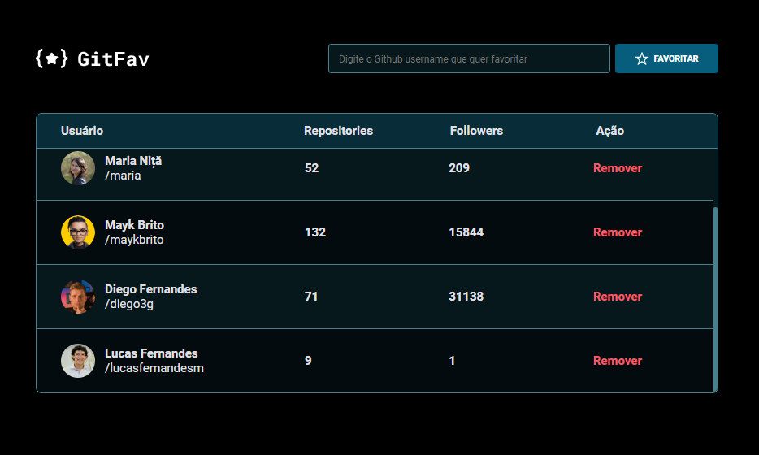

<h1 align="center"> GitFav </h1>

Application that allows the user to add their favorite github profiles to a list  
With a simple search using the username of the desired profile, the user has a list of profiles to consult and get inspired!

  <a href="### 🛠 Tecnologias">Tecnologias</a>&nbsp;&nbsp;&nbsp;|&nbsp;&nbsp;&nbsp;
  <a href="### 🏁 Projeto">Projeto</a>&nbsp;&nbsp;&nbsp;|&nbsp;&nbsp;&nbsp;
  <a href="#memo-licença">Licença</a>

<h1 align="center">
  
</h1>

<h1 align="center">
  
</h1>

### 🛠 Tecnologias

As seguintes ferramentas foram usadas na construção do projeto:
- [HTML]
- [CSS]
- [JavaScript]

### 🏁 Projeto

  - Tem o objetivo de criar uma lista com os perfis favoritos do usuário  
  - Pesquisa realizada de forma simples, digitando username do perfil desejado e clicando em favoritar  
  - Caso o username digitado não exista ou seja digitado duas vezes, a aplicação gera um alerta  
  - Após favoritado, temos foto, nome de usuário, número de seguidores, número de reposiotórios e link para perfil visiveis na tela  
  - Foi utilizado API do Github para buscar informações dos usuários e disponibilizar na aplicação  
  - Projeto desenvolvido durante o curso Formação Full-stack pela plataforma [Rocketseat](https://app.rocketseat.com.br)  
